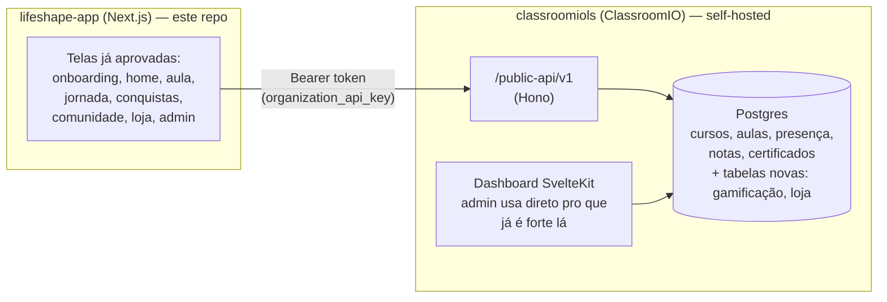

# Plano geral — App Lifeshape

Frontend aprovado (este repo, `lifeshape-app/`) + backend real do ClassroomIO
(`classroomiols`). Este documento é o mapa: arquitetura, o que já dá pra usar
de verdade, o que falta construir, e a esteira de trabalho pra cada etapa.

## 1. Arquitetura

O Next.js nunca fala direto com o Postgres — tudo passa pela API do ClassroomIO,
autenticado por **API key da organização** (`Settings → Automation → API`,
tipo `api`). Essa chave já existe hoje, é gratuita (não depende de licença
Enterprise) e já vem com CORS liberado pra chamada externa — é o mecanismo
certo pra um frontend hospedado em outro domínio.

## 2. O que a API pública do ClassroomIO cobre hoje (checado no código)

| Recurso | Existe em `/public-api/v1`? |
|---|---|
| Cursos (listar/criar/editar) | ✅ `courses.ts` |
| Alunos / matrícula (audience) | ✅ `audience.ts` |
| Conteúdo de aula (módulos, lições, vídeo) | ❌ precisa estender |
| Presença | ❌ precisa estender |
| Notas / submissões / exercícios | ❌ precisa estender |
| Certificados | ❌ precisa estender |
| Analytics/admin (engajamento, KPIs) | ❌ é interno, não público |

Nada disso é ruim — o padrão (rota + serviço + validação + OpenAPI, tudo já
documentado em `prd/public-api [DONE]/README.md`) é claro e fácil de repetir.
Só significa que boa parte das etapas abaixo inclui "adicionar um endpoint
novo no ClassroomIO", não só "consumir o que já existe".

## 3. Decisões em aberto (preciso bater com você antes de codar a etapa correspondente)

1. ~~**Onde o ClassroomIO vai rodar**~~ — **Resolvido**: local, por enquanto
   (ver seção 5-bis). Produção fica pra decidir mais pra frente.
2. ~~**Login de aluno**~~ — **Resolvido**: estendemos a API do ClassroomIO
   (Etapa 1) em vez de reaproveitar cookie/domínio ou usar SSO pago — ver a
   linha da Etapa 1 na tabela abaixo e a seção 5-bis para os detalhes.
3. **Licença AGPL**: como agora vai ser integração de verdade (não só
   inspiração visual), qualquer modificação no código do ClassroomIO rodando
   como serviço pros alunos, pela AGPL, precisa ter o código-fonte
   modificado disponível pra quem usa. Vale confirmar se isso é aceitável ou
   se faz sentido olhar uma licença comercial deles.
4. **Moeda interna e loja**: resgate só por "sementes" ganhas, ou vai ter
   pagamento real (boleto) em algum momento? Impacta o escopo da Etapa 7.

## 4. A esteira de trabalho

Cada etapa abaixo passa pelas mesmas 4 fases antes de eu marcar como pronta:

1. **Brainstorm** — alinho com você as decisões de regra de negócio daquela
   etapa específica antes de escrever código (nada de assumir sozinho coisa
   que muda comportamento pro aluno).
2. **Construção** — implemento (schema novo se precisar, rota + serviço +
   validação no ClassroomIO, integração no Next.js).
3. **Checagem de segurança** — rodo a skill `/security-review` em cima do
   diff daquela etapa antes de considerar fechada.
4. **Aprovação** — você testa e dá o sinal verde antes da próxima etapa.

## 5. Etapas de construção

| # | Etapa | O que muda | Depende de |
|---|---|---|---|
| 0 | ✅ Fundação | ClassroomIO rodando e acessível, org Lifeshape criada, chave de API gerada, cliente HTTP no Next.js — testado ponta a ponta, `/security-review` passou (1 achado alto corrigido: rota de debug sem autenticação foi removida) | Decisão #1 |
| 1 | ✅ Autenticação real | Login/logout, primeiro acesso via convite (cria conta + matricula numa tacada só), esqueci/redefinir senha, persona salva de verdade em `profile.metadata`. Sessão do Next.js é um JWE (cookie httpOnly próprio, nunca o cookie do ClassroomIO) guardando só o bearer token do ClassroomIO. Testado ponta a ponta com Playwright contra os dois servidores reais. `/security-review` nos dois repos achou e corrigiu 1 alto (ClassroomIO: convite com múltiplos e-mails permitidos deixava qualquer um da lista criar a conta de *outro* da lista — corrigido exigindo convite de e-mail único pra criar conta) e 1 baixo (Next.js: cookie de sessão era só assinado, não criptografado de fato — trocado pra JWE de verdade). `/admin` continua sem nenhuma autenticação — aceitável por enquanto (dado 100% fictício, escopo é a Etapa 9), mas fica registrado aqui pra não esquecer quando os dados de admin virarem reais | Decisão #2 |
| 2 | Cursos e aulas | Trocar mock por dados reais; estender API pra trazer módulos/lições/conteúdo de aula | Etapa 0, 1 |
| 3 | Presença automática | Novo endpoint público de presença no ClassroomIO + consumo no Next.js | Etapa 2 |
| 4 | Avaliações e notas | Novo endpoint de submissão/nota + tela de exercício real | Etapa 2 |
| 5 | Jornada/timeline | Agregação dos dados já trazidos (sem API nova) | Etapas 2-4 |
| 6 | Gamificação | Tabelas novas (pontos, streak, nível, emblemas, ranking) + rotas `/public-api/v1/gamification/*` | Decisão de regras de pontuação |
| 7 | Loja virtual | Tabelas novas (produtos, sementes, resgates) + rotas `/public-api/v1/store/*` | Decisão #4 |
| 8 | Comunidade | Decidir: adaptar o Q&A que o ClassroomIO já tem, ou construir mural de turma novo | — |
| 9 | Painel administrativo | Métricas reais (parte pode vir do próprio dashboard do ClassroomIO; o que for diferencial novo — alunos em risco — fica no Next.js) | Etapas 3, 6 |

## 5-bis. Rodando localmente (dev)

Anotado aqui pra não redescobrir na marra na próxima vez.

**`classroomiols`** (na raiz do checkout):
1. Postgres 16 + Redis rodando localmente (`service postgresql start`,
   `service redis-server start` — ou Docker, se preferir seguir o `README.md`
   oficial deles).
2. `packages/db/.env`, `apps/api/.env`, `apps/dashboard/.env`, `apps/jobs/.env`
   — seguir `DEV_SETUP_NOTES.md` à risca (`BETTER_AUTH_SECRET` e
   `PRIVATE_SERVER_KEY` gerados com `openssl rand -hex 32`, o segundo
   **igual** em api e dashboard).
3. `pnpm i`
4. `pnpm turbo run build --continue` — **não** `pnpm build` puro: o
   `@cio/jobs-worker` tem um bug conhecido (`ffmpegProbeLuma`) que derruba o
   build inteiro sem `--continue`, mesmo os pacotes que não dependem dele.
5. `pnpm --filter @cio/db db:setup:seed` — o seed de "exercise templates"
   falha (busca um CDN externo que esse ambiente não alcança); inofensivo,
   o resto do seed (usuários, orgs, cursos, aulas) já foi commitado antes
   dessa etapa.
6. `pnpm api:dev` e `pnpm dashboard:dev` (dois terminais).
7. Organização Lifeshape: `pnpm --filter @cio/db db:create-org "Lifeshape"
   admin@lifeshape.local BASIC lifeshape` (script oficial deles, cria org +
   admin sem senha — "esqueci a senha" define uma se algum dia precisar
   logar na UI como esse admin).
8. Chave de API: por enquanto gerada com um insert direto seguindo o formato
   exato de `apps/api/src/services/organization/automation-key.ts`
   (`cio_api_<24 bytes base64url>`, hash sha256 hex, scope `public_api:*`) —
   o normal, quando a UI de Automation estiver acessível, é gerar pela tela
   Settings → Automation → API.
9. Desde a Etapa 1: `TRUSTED_ORIGINS` em `apps/api/.env` precisa incluir a
   origem do Next.js (`http://localhost:3000` local) — sem isso o link de
   "esqueci minha senha" quebra no passo do redirect (Better Auth rejeita
   `callbackURL` fora de `trustedOrigins`). `LIFESHAPE_APP_URL` também
   precisa apontar pro Next.js (mesmo motivo: monta o link do e-mail).
10. Convite de teste: como ainda não existe UI de admin nem no ClassroomIO
    nem no Next.js pra gerar convite (isso é Etapa 9), um convite de teste
    hoje é um insert direto em `course_invite` — token = 32 bytes
    aleatórios em base64url, `token_hash` = sha256 hex dele,
    `allowed_emails` com **um só** e-mail (múltiplos é suportado pelo
    schema mas a Etapa 1 exige convite de e-mail único — ver achado de
    segurança na tabela acima). Link pro aluno:
    `http://localhost:3000/convite/<token>`.

**`lifeshape-app`**: `CLASSROOMIO_API_URL`, `CLASSROOMIO_API_KEY` e (desde a
Etapa 1) `SESSION_SECRET` em `.env.local` (nunca committado — ver
`.env.example`; `SESSION_SECRET` é `openssl rand -base64 32`, só desse app,
nunca do ClassroomIO). `npm run dev` — repara que não é mais export estático
(`next.config.ts` mudou na Etapa 0), então isso já roda com Server
Components/rotas dinâmicas de verdade.

⚠️ **Pegadinha que já mordeu uma vez**: se `SESSION_SECRET` (ou qualquer
env var que devia vir só do `.env.local`) estiver de alguma forma exportada
no shell que sobe o `npm run dev`, ela silenciosamente ganha prioridade
sobre o `.env.local` — comportamento padrão de todo carregador de dotenv,
não é bug do Next.js. Sintoma: login/sessão falha com um erro genérico sem
motivo aparente. `echo $SESSION_SECRET` (ou a env var em questão) antes de
subir o servidor pra confirmar que está vazio, e/ou `env -u SESSION_SECRET
npm run dev`.

## 6. Próximo passo imediato

Etapa 1 fechada. Próximo é o brainstorm da Etapa 2 (Cursos e aulas — trocar
o mock de `src/lib/data.ts` por dados reais do ClassroomIO; a public API
de hoje só tem `courses`/`audience`, então parte da etapa é estender ela
com módulos/lições/conteúdo de aula).
