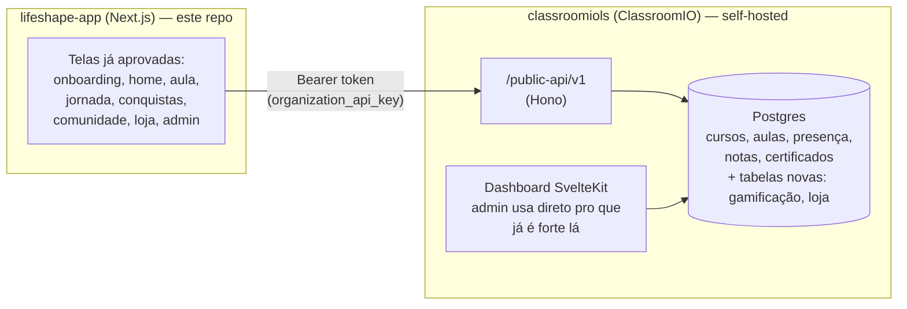

# Plano geral — App Lifeshape

Frontend aprovado (este repo, `lifeshape-app/`) + backend real do ClassroomIO
(`classroomiols`). Este documento é o mapa: arquitetura, o que já dá pra usar
de verdade, o que falta construir, e a esteira de trabalho pra cada etapa.

## 1. Arquitetura

O Next.js nunca fala direto com o Postgres — tudo passa pela API do ClassroomIO,
autenticado por **API key da organização** (`Settings → Automation → API`,
tipo `api`). Essa chave já existe hoje, é gratuita (não depende de licença
Enterprise) e já vem com CORS liberado pra chamada externa — é o mecanismo
certo pra um frontend hospedado em outro domínio.

## 2. O que a API pública do ClassroomIO cobre hoje (checado no código)

| Recurso | Existe em `/public-api/v1`? |
|---|---|
| Cursos (listar/criar/editar) | ✅ `courses.ts` |
| Alunos / matrícula (audience) | ✅ `audience.ts` |
| Conteúdo de aula (módulos, lições, vídeo) | ❌ precisa estender |
| Presença | ❌ precisa estender |
| Notas / submissões / exercícios | ❌ precisa estender |
| Certificados | ❌ precisa estender |
| Analytics/admin (engajamento, KPIs) | ❌ é interno, não público |

Nada disso é ruim — o padrão (rota + serviço + validação + OpenAPI, tudo já
documentado em `prd/public-api [DONE]/README.md`) é claro e fácil de repetir.
Só significa que boa parte das etapas abaixo inclui "adicionar um endpoint
novo no ClassroomIO", não só "consumir o que já existe".

## 3. Decisões em aberto (preciso bater com você antes de codar a etapa correspondente)

1. ~~**Onde o ClassroomIO vai rodar**~~ — **Resolvido**: local, por enquanto
   (ver seção 5-bis). Produção fica pra decidir mais pra frente.
2. ~~**Login de aluno**~~ — **Resolvido**: estendemos a API do ClassroomIO
   (Etapa 1) em vez de reaproveitar cookie/domínio ou usar SSO pago — ver a
   linha da Etapa 1 na tabela abaixo e a seção 5-bis para os detalhes.
3. **Licença AGPL**: como agora vai ser integração de verdade (não só
   inspiração visual), qualquer modificação no código do ClassroomIO rodando
   como serviço pros alunos, pela AGPL, precisa ter o código-fonte
   modificado disponível pra quem usa. Vale confirmar se isso é aceitável ou
   se faz sentido olhar uma licença comercial deles.
4. **Moeda interna e loja**: resgate só por "sementes" ganhas, ou vai ter
   pagamento real (boleto) em algum momento? Impacta o escopo da Etapa 7.

## 4. A esteira de trabalho

Cada etapa abaixo passa pelas mesmas 4 fases antes de eu marcar como pronta:

1. **Brainstorm** — alinho com você as decisões de regra de negócio daquela
   etapa específica antes de escrever código (nada de assumir sozinho coisa
   que muda comportamento pro aluno).
2. **Construção** — implemento (schema novo se precisar, rota + serviço +
   validação no ClassroomIO, integração no Next.js).
3. **Checagem de segurança** — rodo a skill `/security-review` em cima do
   diff daquela etapa antes de considerar fechada.
4. **Aprovação** — você testa e dá o sinal verde antes da próxima etapa.

## 5. Etapas de construção

| # | Etapa | O que muda | Depende de |
|---|---|---|---|
| 0 | ✅ Fundação | ClassroomIO rodando e acessível, org Lifeshape criada, chave de API gerada, cliente HTTP no Next.js — testado ponta a ponta, `/security-review` passou (1 achado alto corrigido: rota de debug sem autenticação foi removida) | Decisão #1 |
| 1 | ✅ Autenticação real | Login/logout, primeiro acesso via convite (cria conta + matricula numa tacada só), esqueci/redefinir senha, persona salva de verdade em `profile.metadata`. Sessão do Next.js é um JWE (cookie httpOnly próprio, nunca o cookie do ClassroomIO) guardando só o bearer token do ClassroomIO. Testado ponta a ponta com Playwright contra os dois servidores reais. `/security-review` nos dois repos achou e corrigiu 1 alto (ClassroomIO: convite com múltiplos e-mails permitidos deixava qualquer um da lista criar a conta de *outro* da lista — corrigido exigindo convite de e-mail único pra criar conta) e 1 baixo (Next.js: cookie de sessão era só assinado, não criptografado de fato — trocado pra JWE de verdade). `/admin` continua sem nenhuma autenticação — aceitável por enquanto (dado 100% fictício, escopo é a Etapa 9), mas fica registrado aqui pra não esquecer quando os dados de admin virarem reais | Decisão #2 |
| 2 | ✅ Cursos e aulas reais | Mock trocado por dados reais nas telas de curso/aula. Novo `/public-api/student/*` no ClassroomIO (mesma postura de acesso da Etapa 1: bearer token do aluno, sem chave de organização) reaproveitando os serviços internos maduros do próprio ClassroomIO (conteúdo agrupado por módulo, regras de progressão, certificação) em vez de reinventar. `home`, `cursos`, `cursos/[slug]` e a aula (`cursos/[slug]/[lessonId]`) reescritos pra buscar dados reais via `requireSession()`. Testado ponta a ponta com Playwright contra os servidores reais: catálogo só mostra curso em que o aluno está matriculado de fato, "próxima aula" e progresso na home são reais, os 3 módulos/14 aulas de "Gestão e Liderança" aparecem certos, marcar/desmarcar aula concluída persiste de verdade (sobrevive a reload). `/security-review` nos dois repos achou 3 candidatos; 1 confirmado e corrigido (ClassroomIO: curso apagado por um admin — soft delete, `status='DELETED'` — continuava 100% legível e completável por quem já estava matriculado, podendo até emitir certificado de um curso que a organização tirou do ar; corrigido checando `status = 'ACTIVE'` no mesmo lugar que já checa matrícula), 2 descartados após verificação (um 404 diferenciado que confirma a existência de uma aula sem dar acesso a ela — real, mas abaixo da régua por UUID não ser adivinhável; e uma suspeita de que a conclusão manual não respeitava `completionPolicy` de vídeo, que na prática já era bloqueada com 400, ponta a ponta). Gamificação (sementes/streak/nível/anéis), categoria/turma/ícone por curso e "presença confirmada" continuam mock/ausentes de propósito — sem equivalente real ainda ou são escopo de etapa futura (documentado no código) | Etapa 0, 1 |
| 3 | ✅ Presença | Configurável por curso: métodos de check-in habilitáveis (botão do aluno, QR code, lançamento manual na portaria) + exige aprovação do professor ou não. Sequência (streak) contada por aula do curso, não por calendário — recalculada na hora a partir dos registros reais, sem contador separado. Reaproveita `group_attendance` (já existia, estendida com status/método/quem aprovou) em vez de tabela paralela. Novo `/public-api/staff/*` (bearer, ADMIN/TUTOR do curso específico) pra configurar/aprovar/marcar manual/gerar QR — sem tela ainda (Etapa 9), endpoints usáveis hoje. QR assinado por HMAC com janela de validade. Testado ponta a ponta: botão de confirmar, aprovação/rejeição, marcação manual, QR completo (payload real → confirma → título certo → persiste), sequência com numeração real de módulo. `/security-review` achou 4 candidatos nos dois repos — **2 altos corrigidos**: `assertStaffCourseAccess` usava a checagem errada (`isUserCourseMemberOrOrgAdmin`, "qualquer membro") em vez da certa (`isCourseTeamMemberOrOrgAdmin`, "ADMIN/TUTOR desse curso específico"), e o middleware de staff checava o cargo pra uma org "qualquer" (primeira do mapa) em vez da org do curso sendo acessado — juntos, deixavam um tutor de um curso (ou até um aluno comum de outro) mexer em curso alheio (configurar, aprovar presença, marcar manual, gerar QR de outros). Corrigido lendo o `:courseId` da rota e checando a equipe *daquele* curso especificamente. Também corrigidos: QR sem validade nenhuma (o mesmo código funcionava pra sempre — uma foto do QR compartilhada no grupo da turma valeria indefinidamente; agora expira em 2h) e uma falta de checagem de que a aula pertence ao curso ao marcar presença manual. Ver detalhes técnicos completos na seção 5-ter | Etapa 2 |
| 4 | ✅ Avaliações e estágio | Reaproveita o motor de exercícios/notas já maduro do ClassroomIO (não construído do zero): aba "Exercício" da aula responde de verdade (múltipla escolha, V/F, resposta curta, numérico, texto, upload de arquivo — 7 tipos; os demais aparecem como "não suportado" sem travar o resto). Estágio obrigatório/horas complementares (dobrado nesta etapa por decisão do cliente) virou um exercício com uma marca a mais (`exercise.kind='internship'`) e duas perguntas fixas — sem tabela nova, só `submission.approved_weeks` (nullable) pra guardar a quantidade de semanas aprovada pelo coordenador, calculada e somada na hora a partir dos envios reais (mesmo estilo do streak de presença). Nunca revela qual opção é a correta antes/depois de responder. Testado ponta a ponta com curl e Playwright contra os servidores reais. `/security-review` nos dois repos: lifeshape-app sem achados; classroomiols achou 1 candidato (médio) — verificação independente descartou como vulnerabilidade real (exige quem já é ADMIN/TUTOR do curso, sem escalação de privilégio) mas a investigação achou uma inconsistência de verdade (campo `approvedWeeks` vazando pra fora do escopo de estágio) e a correção foi aplicada mesmo assim, por ser barata e fechar uma lacuna real — ver seção 5-quater | Etapa 2 |
| 5 | Jornada/timeline | Agregação dos dados já trazidos (sem API nova) | Etapas 2-4 |
| 6 | Gamificação | Tabelas novas (pontos, streak, nível, emblemas, ranking) + rotas `/public-api/v1/gamification/*` | Decisão de regras de pontuação |
| 7 | Loja virtual | Tabelas novas (produtos, sementes, resgates) + rotas `/public-api/v1/store/*` | Decisão #4 |
| 8 | Comunidade | Decidir: adaptar o Q&A que o ClassroomIO já tem, ou construir mural de turma novo | — |
| 9 | Painel administrativo | Métricas reais (parte pode vir do próprio dashboard do ClassroomIO; o que for diferencial novo — alunos em risco — fica no Next.js) | Etapas 3, 6 |

## 5-bis. Rodando localmente (dev)

Anotado aqui pra não redescobrir na marra na próxima vez.

**`classroomiols`** (na raiz do checkout):
1. Postgres 16 + Redis rodando localmente (`service postgresql start`,
   `service redis-server start` — ou Docker, se preferir seguir o `README.md`
   oficial deles).
2. `packages/db/.env`, `apps/api/.env`, `apps/dashboard/.env`, `apps/jobs/.env`
   — seguir `DEV_SETUP_NOTES.md` à risca (`BETTER_AUTH_SECRET` e
   `PRIVATE_SERVER_KEY` gerados com `openssl rand -hex 32`, o segundo
   **igual** em api e dashboard).
3. `pnpm i`
4. `pnpm turbo run build --continue` — **não** `pnpm build` puro: o
   `@cio/jobs-worker` tem um bug conhecido (`ffmpegProbeLuma`) que derruba o
   build inteiro sem `--continue`, mesmo os pacotes que não dependem dele.
5. `pnpm --filter @cio/db db:setup:seed` — o seed de "exercise templates"
   falha (busca um CDN externo que esse ambiente não alcança); inofensivo,
   o resto do seed (usuários, orgs, cursos, aulas) já foi commitado antes
   dessa etapa.
6. `pnpm api:dev` e `pnpm dashboard:dev` (dois terminais).
7. Organização Lifeshape: `pnpm --filter @cio/db db:create-org "Lifeshape"
   admin@lifeshape.local BASIC lifeshape` (script oficial deles, cria org +
   admin sem senha — "esqueci a senha" define uma se algum dia precisar
   logar na UI como esse admin).
8. Chave de API: por enquanto gerada com um insert direto seguindo o formato
   exato de `apps/api/src/services/organization/automation-key.ts`
   (`cio_api_<24 bytes base64url>`, hash sha256 hex, scope `public_api:*`) —
   o normal, quando a UI de Automation estiver acessível, é gerar pela tela
   Settings → Automation → API.
9. Desde a Etapa 1: `TRUSTED_ORIGINS` em `apps/api/.env` precisa incluir a
   origem do Next.js (`http://localhost:3000` local) — sem isso o link de
   "esqueci minha senha" quebra no passo do redirect (Better Auth rejeita
   `callbackURL` fora de `trustedOrigins`). `LIFESHAPE_APP_URL` também
   precisa apontar pro Next.js (mesmo motivo: monta o link do e-mail).
10. Convite de teste: como ainda não existe UI de admin nem no ClassroomIO
    nem no Next.js pra gerar convite (isso é Etapa 9), um convite de teste
    hoje é um insert direto em `course_invite` — token = 32 bytes
    aleatórios em base64url, `token_hash` = sha256 hex dele,
    `allowed_emails` com **um só** e-mail (múltiplos é suportado pelo
    schema mas a Etapa 1 exige convite de e-mail único — ver achado de
    segurança na tabela acima). Link pro aluno:
    `http://localhost:3000/convite/<token>`.
11. Conteúdo de exemplo: os 4 cursos citados no `data.ts` existem de
    verdade no ClassroomIO local (`Gestão e Liderança`, `Fundamentos da
    Fé`, `Impacto 2025 — Preparação de Equipe`, `Fundamentos para Líderes
    de Casa`), cada um com seu próprio `group` (nunca compartilhar group
    entre cursos — é o roster de UM curso, não uma "turma" que atravessa
    vários; compartilhar quebrou matrícula durante o teste da Etapa 1) e
    módulos/aulas reais (`course_section`/`lesson`) com os mesmos
    títulos/textos do mock aprovado — sem vídeo/documento de verdade
    ainda. Sem UI de conteúdo ainda (isso é a Etapa 2), então foi um
    script SQL direto; se o banco for resetado, o script não foi
    commitado neste repo (é conteúdo, não schema) — dá pra reconstruir
    fila por fila a partir do `data.ts` se precisar. IDs sempre via
    `gen_random_uuid()` — um id "bonito" tipo `22222222-...` falha na
    validação estrita de UUID (Zod v4) usada pelos endpoints da Etapa 2
    porque não é um UUID v4 de verdade (nibble de versão/variante errado).
12. Desde a Etapa 2: aluno de teste com curso e progresso reais —
    `etapa2.teste@example.com` / `senhaEtapa2Teste123`, matriculado em
    "Gestão e Liderança". Mesma lógica do item acima: inserido direto no
    banco (audience/matrícula ainda não tem UI), não commitado.

**`lifeshape-app`**: `CLASSROOMIO_API_URL`, `CLASSROOMIO_API_KEY` e (desde a
Etapa 1) `SESSION_SECRET` em `.env.local` (nunca committado — ver
`.env.example`; `SESSION_SECRET` é `openssl rand -base64 32`, só desse app,
nunca do ClassroomIO). `npm run dev` — repara que não é mais export estático
(`next.config.ts` mudou na Etapa 0), então isso já roda com Server
Components/rotas dinâmicas de verdade.

⚠️ **Pegadinha que já mordeu uma vez**: se `SESSION_SECRET` (ou qualquer
env var que devia vir só do `.env.local`) estiver de alguma forma exportada
no shell que sobe o `npm run dev`, ela silenciosamente ganha prioridade
sobre o `.env.local` — comportamento padrão de todo carregador de dotenv,
não é bug do Next.js. Sintoma: login/sessão falha com um erro genérico sem
motivo aparente. `echo $SESSION_SECRET` (ou a env var em questão) antes de
subir o servidor pra confirmar que está vazio, e/ou `env -u SESSION_SECRET
npm run dev`.

⚠️ **Duas pegadinhas novas da Etapa 3, no lado `classroomiols`**:

- Editar algo em `packages/db/src` ou `packages/utils/src` e testar contra
  o servidor rodando **não reflete a mudança** — `apps/api` resolve esses
  pacotes pelo `dist/` já compilado (via `exports` do `package.json`), não
  pelo `src/` direto, ao contrário do que os watchers do `pnpm api:dev`
  fariam parecer. `tsc --noEmit` também vai reclamar de export "inexistente"
  nesse meio tempo, mesmo com o código certo. Rodar `pnpm --filter @cio/db
  build` (ou `@cio/utils`) depois de editar esses pacotes, e reiniciar o
  `pnpm api:dev`, antes de testar ou confiar no type-check.
- Middleware que precisa ler `c.req.param('algumaCoisa')` (tipo
  `courseMemberMiddleware` já fazia) só funciona registrado **por rota**
  (`.get('/:courseId/x', meuMiddleware, handler)`), nunca como
  `.use('*', meuMiddleware)` no topo do router — nesse ponto o Hono ainda
  não casou a rota específica, então o parâmetro nomeado não existe. Isso
  causou um bug real nesta etapa (`staffSessionMiddleware` retornando
  "Curso não especificado" sempre) até eu perceber e mover pra dentro de
  cada rota.

## 5-ter. Etapa 3 — Presença: especificação (brainstorm com você, 2026-09-14)

**Os 3 segmentos e como presença funciona pra cada um** (mesmo motor, configurado diferente por curso):

| Segmento | Curso | Cadência | Como confirma presença |
|---|---|---|---|
| Universitários (Lifeshapers) | Liderança, 3 anos | pode ser só 1 aula/mês | Aluno aperta botão no app → fica **pendente** até o professor aprovar → só then conta |
| Profissionais cristãos | curso curto, 3 módulos, com encontros presenciais | — | Confirma automático ao "participar" (sem aprovação extra) |
| Pastores | mentoria pastoral | encontros mensais | Confirma automático ao "participar" (igual profissionais) |

**Métodos de check-in** — não é "escolha 1 pra sempre", é uma lista de métodos habilitados por curso, o coordenador decide quais valem pra cada turma:
- Botão do próprio aluno no app ("apertar e confirmar presença").
- QR code escaneado na entrada.
- Lançamento manual por quem está na portaria/professor.

Cada curso tem dois parâmetros independentes: **quais métodos estão ligados** (pode ser mais de um ao mesmo tempo) e **precisa de aprovação do professor ou vale na hora**. Universitários = botão ligado + aprovação obrigatória. Profissionais/pastores = qualquer método ligado + sem aprovação (confirma na hora).

**Sequência (streak)**: não conta por dia/semana de calendário — conta por **aula consecutiva do próprio curso**, porque a cadência varia demais (universitário só tem 1 aula/mês). Falta quebra a sequência. O coordenador pode "restaurar": na prática isso é só ele lançar manualmente a presença daquela aula passada que faltou — o sistema recalcula a sequência sozinho a partir dos registros reais, não existe um "valor de sequência" guardado separado pra desincronizar da realidade.

**Decisão técnica**: reaproveitar a tabela `group_attendance` que **já existe** no ClassroomIO (usada hoje só pelo professor marcando manualmente presença por aula, sem workflow nenhum) em vez de criar uma paralela — estendendo com as colunas que faltam (status pendente/confirmado/recusado, método usado, quem aprovou). Sequência é sempre calculada na hora a partir dos registros reais (o mesmo estilo já usado pra progresso de curso), não um contador mantido à parte.

**Ficou de fora desta etapa, decisão em aberto**: a parte de **estágio obrigatório** (aluno manda relatório + comprovante, coordenador aprova quantidade de semanas como horas complementares) que você mencionou junto com presença. Não é o mesmo formato de dado (é submissão + aprovação de quantidade, não check-in de aula) — se parece mais com o que a Etapa 4 (Avaliações e notas) já ia construir (submissão do aluno → aprovação/nota de um professor). Minha sugestão: construir presença primeiro (esta etapa), e tratar estágio como parte da Etapa 4 ou como uma etapa própria depois — me avisa se prefere diferente.

**Não entra nesta etapa**: uma tela de coordenador/professor de verdade no Next.js (aprovar pendências, gerar QR, marcar manual) — isso é painel administrativo, Etapa 9. As ações do lado do professor/coordenador viram endpoints reais e seguros no ClassroomIO (prontos pra qualquer front consumir depois), mas sem tela nova agora — mesmo padrão já usado nas Etapas 1/2 pro lado admin (convite/conteúdo de curso também não têm tela ainda).

## 5-quater. Etapa 4 — Avaliações e estágio: especificação (investigação + brainstorm, 2026-09-15)

**Achado principal**: o ClassroomIO já tem um motor de exercícios/notas maduro e completo — `exercise` → `question` (16 tipos: múltipla escolha, verdadeiro/falso, texto livre, numérico, upload de arquivo, gravação de vídeo, etc.) → `option` → `submission` → `question_answer`, com correção automática pra tipos objetivos e correção manual pra tipos subjetivos (texto, arquivo, vídeo), estado de correção (`queued`/`awaiting_manual`/`completed`), nota (`total`), feedback do professor, e-mail de notificação nos dois sentidos, e até integração com o certificado do curso. Mesmo padrão das etapas anteriores: reaproveitar em vez de reinventar (igual `group_attendance` na Etapa 3).

**O que o app agora faz de verdade**: aluno responde um exercício de aula real (aba "Exercício" que antes era só um aviso) — múltipla escolha, verdadeiro/falso, resposta curta, numérico, texto longo e upload de arquivo (7 tipos; os outros 9 tipos do motor — preenchimento de lacuna, ordenação, banco de palavras, link, estrela, vídeo, etc. — não têm tela no app ainda, aparecem como "tipo não suportado" sem travar o resto do exercício). Nunca mostra qual opção é a correta antes (nem depois) de responder — o `isCorrect` de cada opção e o `settings` da pergunta (que em alguns tipos carrega o gabarito) nunca saem do backend pro aluno.

**Estágio obrigatório/horas complementares** (decisão do cliente: entrou nesta etapa, ver seção 6 antiga) — modelado como um exercício **igual aos outros**, só com uma marca a mais (`exercise.kind = 'internship'`) e duas perguntas fixas (texto "Relatório de atividades" + upload "Comprovante"), criadas de uma vez por um endpoint de setup do coordenador. Isso significa: reaproveita 100% do motor de submissão/anexo já existente, sem tabela nova. A única coisa genuinamente nova é "quantas semanas o coordenador aprova" — não é uma nota (0 a pontos máximos), é uma contagem, então virou uma coluna nova e específica (`submission.approved_weeks`, opcional) em vez de forçar isso dentro de `total`. O app soma as semanas aprovadas de todos os envios `completed` do aluno naquele curso e mostra o total (`/cursos/[slug]/estagio`) — like a sequência de presença, calculado na hora a partir dos registros reais, não um contador à parte.

**Não entra nesta etapa** (mesmo padrão de sempre): tela de correção de exercício comum pro coordenador — o ClassroomIO já tem um quadro de correção maduro no dashboard dele (Submitted/In Progress/Graded), então o professor corrige por lá mesmo, sem precisar de nada novo. Só a parte de estágio (que o dashboard não sabe o que é "semanas aprovadas") ganhou endpoint de staff dedicado (`setup`/`submissions`/`review`), sem tela — mesmo adiamento pra Etapa 9 já usado em presença.

**Limitação de ambiente conhecida (não é bug)**: este ambiente de desenvolvimento local não tem armazenamento de objetos configurado (nem MinIO nem S3/R2 — precisa de `OBJECT_STORAGE_*` ou `CLOUDFLARE_*` no `.env`, ver `packages/core/src/config/storage.ts`). Upload de arquivo (comprovante de estágio, ou qualquer FILE_UPLOAD de exercício) pede a URL assinada certinho, mas a chamada final ao storage falha até isso ser configurado — mesma limitação que já existia antes desta etapa pra vídeo/documento de curso. Testado ponta a ponta com um `fileKey` simulado pra validar toda a lógica de submissão/aprovação; testado também que a falha do upload real aparece como erro tratado na tela, não como crash.

**`/security-review` — o que foi encontrado**: rodado nos dois repos (identificação → agente de filtro independente por achado → só conta o que fica com confiança ≥8, mesmo processo das etapas anteriores).
- lifeshape-app: nenhum achado.
- classroomiols: 1 candidato (severidade média sugerida) — o campo novo `approvedWeeks` podia, em teoria, ser setado numa submissão de exercício comum através da tela de correção que já existe no dashboard (`updateSubmissionGradesBatch` é compartilhado entre a revisão de estágio e a correção comum, e nada checava `exercise.kind` antes de gravar). Agente de filtro deu confiança 2/10 pra isso como *vulnerabilidade de segurança* — exige alguém que já é ADMIN/TUTOR daquele curso específico (mesmo nível de acesso que já deixa editar nota/feedback/resposta de qualquer envio ali), sem escalação de privilégio nem vazamento entre usuários/cursos, então não conta como achado real. Mas o mesmo agente achou, ao verificar, que esse campo *de fato* vazava na resposta de exercícios comuns (não só na de estágio) — isso sim uma inconsistência real, então apliquei a correção de qualquer forma: `updateSubmissionGradesBatch` agora só aceita `approvedWeeks` quando o exercício é `kind='internship'` (rejeita com erro claro caso contrário), e a resposta de exercício comum não devolve mais esse campo. Verificado contra o servidor real nos dois sentidos (correção comum sem o campo continua ok; tentativa de setá-lo é rejeitada; fluxo de estágio continua funcionando ponta a ponta).
- Achados anteriores da checagem cross-course/staff (Etapa 3) foram reverificados nesta etapa e continuam corretos — `staffSessionMiddleware` aplicado por rota nos 3 endpoints novos de staff, `reviewInternshipSubmission` confere curso *e* exercício da submissão antes de gravar.

## 6. Próximo passo imediato

Etapa 4 fechada (motor de exercícios real + estágio/horas complementares,
backend + Next.js, `/security-review` nos dois repos, achado corrigido
e reverificado). Ponto de aprovação: vale testar antes de eu seguir pra
Etapa 5 (Jornada/timeline — agregação do que já foi trazido, sem API nova,
por isso deve ser rápida).

**Pendências que ficaram pra trás, não esquecer**:
- A sequência (streak) de presença real já existe e funciona
  (`/public-api/student/courses/:id/attendance`), mas ainda não foi ligada
  na tela — a home continua mostrando o streak mock (`student.streak` do
  `data.ts`) no chip de "sequência". Ligar isso é rápido (a API já existe).
- Gamificação (sementes/pontos/nível) continua mock — Etapa 6.
- Tela de coordenador de verdade (aprovar presença/estágio, corrigir
  exercício, gerar QR) — Etapa 9. Todos os endpoints já existem e
  funcionam hoje, só sem interface.
